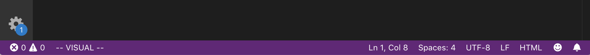

# VS Code + Vim
**Why use Vim?** It's powerful and will save you time, but takes you one month+ to learn.

**Why use Vim + VS Code?** So you can learn Vim slowly without affecting your coding efficiency.

With the VSCodeVim plugin you can add vim keybindings without losing mouse functionality or shortcuts (Command + S to save), this is temporary until you realize why reaching for your mouse is so inefficient.

If you don't like Vim then just uninstall the plugin. Boom you're back to using plain VS Code.

 
# Installation
Download [Visual Studio Code](https://code.visualstudio.com/)
 
Install [VSCodeVim](https://marketplace.visualstudio.com/items?itemName=vscodevim.vim) from the marketplace
 
# Keyboard Settings
1. Change Esc key to Caps Lock (You use Esc a lot in vim, this is more efficient)
2. Increase Key Repeat to fast (For faster navigation)
3. Increase Delay Until Repeat to second shortest (Press and hold keys activate faster)
### For MacOS:
* System Preferences > Keyboard > Modifier Keys... > Caps Lock Key: <strong>Escape</strong>
* System Preferences > Keyboard > Modifier Keys... > Key Repeat
* System Preferences > Keyboard > Modifier Keys... > Delay Until Repeat
 
If key repeating doesn't work on VS Code then try:
```
$ defaults write com.microsoft.VSCode ApplePressAndHoldEnabled -bool false         # For VS Code
$ defaults write com.microsoft.VSCodeInsiders ApplePressAndHoldEnabled -bool false # For VS Code Insider
$ defaults delete -g ApplePressAndHoldEnabled                                      # If necessary, reset global default
```
### For Windows:
* ¯\ _(ツ)_/¯
 
 
# VS Code Vim Configuration
In VS Code > Preferences > Settings > User > Extensions > Vim Configuration
### Enable:
* Easymotion [Github for more info](https://github.com/easymotion/vim-easymotion)
* Highlightedyank (Highlight when yanking (vim's version of copying))
* Hlsearch (Highlight when searching. Ex. "/word-to-search-for" in normal mode)
* Sneak [Github for more info](https://github.com/VSCodeVim/Vim#vim-sneak)
* Incsearch
* Surround [Github for more info](https://github.com/VSCodeVim/Vim#vim-surround)
* Use Ctrl Keys
* Use System Clipboard
### Change:
* leader key (default is \ ) to spacebar (space)
* Change Line Numbers from on to <strong>relative</strong>
  * Located in VS Code > Preferences > Settings > User > Extensions > Text Editor > Line Number
  * This is useful when using `10y` which yanks (copies) 10 lines under the cursor.
  
### Modes
Vim has many "Modes" the three important modes are:
 
#### Normal

  * You want to be in this mode as much as possible. You enter this mode by hitting the Esc key (or Caps Lock if you changed it to Esc)
  * This is where you can can navigate the cursor using `hjkl` keys (or arrow keys if your new), Search for words in one command `/word-to-find`, or add parentheses around a word using `ysw(`
 
#### Insert

  * This is what you're use to. Here you can type like a normal keyboard `hjkl` actually type hjkl instead of moving your cursor
  * You can enter this mode in mutiple ways. When in normal mode you can use `i` to enter insert mode
  * `cw` (<strong>C</strong>hange <strong>W</strong>ord) in normal mode will delete the word under your cursor and put you in insert mode, where you can start typing the word to replace it
  
#### Visual

* This is Vim's highlight mode
* You can enter this mode by typing `v` in normal mode
* `Shift + v` highlights the whole line, you can then use the arrow keys or `jk` keys to highlight up and down, followed by `y` to yank (copy) the highlighted text
* `Ctrl + v` lets you highlight verticly so a list like:
   ```
   1. first
   2. second
   3. third
   ```
   Can turn into:
   ```
   first
   second
   third
   ```
by using `Ctrl + v lljjx`
(Ctrl + v = vertical highlight) (ll = 2x right arrow) (jj = 2x down arrows) (x = delete)

# Beginner Tips
### Learn what you can do in normal mode.
* Take a look at my Vim highlights section to see my most used commands
* Print or bookmark this [vim cheatsheet](https://devhints.io/vim)

### Use normal mode
You always want to be in normal mode as much as possible. After you type a peice of code you want to hit the Esc Key (remember we remapped Caps Key to Esc key) that way you can navigate in normal mode or run a command like `:w` to save the document.

### Mouse -> Arrow keys -> hjkl 
Get to know what Vim can do first before learning how to navigate in Vim. Navigation is very different from what you're use to. In Vim we use `hjkl`, `w`, `:10`, `gg`, and many more commands to move around. 

This can be hard to understand so at first. I would suggest using the arrow keys so you can focus on learning how to use yank, delete, `cw`, or visual mode. **Don't spend too much time using the arrow keys** because ultimate you want to avoid using the arrow keys and mouse and instead use Vim navigation (see my navigation highlight below)

### Don't memorize the commands
You might see a command like `csw{` and think to yourself "I have to learn commands like I learn function names from a programming language". 

No.

`csw{` changes the word under your cursor from `hello world` to `{ hello } world`.

The way we remember the command as **C**hange **S**urround **W**ord { and the Vim Surround plugin will do the rest

Check out this [great article](https://yanpritzker.com/learn-to-speak-vim-verbs-nouns-and-modifiers-d7bfed1f6b2d) to learn about Vim verbs, modifiers, and text objects 


# Vim Highlights

## Delete , Copy, Paste, Undo, and Redo Highlights
|    Command    |      Desc     |
| ------------- | ------------- |
| dd | delete whole line |
| x | cut | 
| shift + y | yank (copy) the whole line (move up or down to keep highlighting)|
| p | paste, whatever you yanked, under your cursor |
| shift + p | paste, whatever you yanked, above your cursor |
| u | Undo! |
| . | redo last command (ex: `$a.` to add a period to end of line. Then move down use `j.` to go down one line and add a period to the next line. `j.j.j.j.j.j.j.` to add a period to all 7 lines below |


## Insert Highlights
|    Command    |      Desc     |
| ------------- | ------------- |
| o | add new line under cursor and enter insert mode |
| shift + o | add new line above cursor and enter insert mode |
| ci( | **C**ange **I**side parentheses |

## Surround Plugin Highlights
Everything in the [readme.md](https://github.com/tpope/vim-surround)

|    Command    |      Desc     |
| ------------- | ------------- |
| cs'" | change 'hi' to "hi" |
| csw{ | change `hi` to `{ hi }` |
| csw\<div> | \<div> something \</div> |


## Visual Highlights
|    Command    |      Desc     |
| ------------- | ------------- |
| 10y | yanks 10 lines under cursor |
| yy | yank the whole line |
| ctrl + v | Vertcal highlighing (go down and right to highlight) |
| ctrl + v then c | Vertical highlight multiple lines then insert in multi lines |


## Navigation Highlights
[Learn the fundamtals of navigation](https://www.thegeekstuff.com/2009/03/8-essential-vim-editor-navigation-fundamentals/)


|    Command    |      Desc     |
| ------------- | ------------- |
| w | move by word |
| shift + w | move down one line |
| b | move backwards one word |
| shift + b | move up by one line |
| e | move to end of word |
| shift + h | Go to top of screen |
| Shift + l | Go to bottom of screen |
| gg | Go to top of file  |
| shift+ g  | Go to bottom of file  |
|:n | Goes to line number n |
